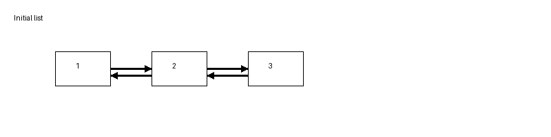

# Doubly Linked List in Scala 3

## Overview

This project implements a **Doubly Linked List** data structure in **Scala 3** from scratch, without using built-in collection implementations.

A doubly linked list is a dynamic data structure where each node stores:

* a value
* a reference to the **next node**
* a reference to the **previous node**

This allows traversal in **both directions**, making certain operations such as insertion and deletion more efficient compared to other structures.

The goal of this project is to demonstrate a **deep understanding of data structures and pointer-based memory relationships** in Scala.

---

# Features

The implementation includes the following operations:

### Core operations

* `addFirst(value)` – insert element at the beginning
* `addLast(value)` – insert element at the end
* `insert(index, value)` – insert element at a specific position

### Access operations

* `get(index)` – retrieve element by index
* `set(index, value)` – update element value
* `contains(value)` – check if element exists
* `indexOf(value)` – find element index

### Removal operations

* `removeFirst()` – remove first element
* `removeLast()` – remove last element
* `remove(index)` – remove element by index
* `clear()` – remove all elements

### Utility operations

* `size`
* `isEmpty`
* `iterator`
* `toString()`

---

# Complexity

| Operation     | Time Complexity |
| ------------- | --------------- |
| addFirst      | O(1)            |
| addLast       | O(1)            |
| removeFirst   | O(1)            |
| removeLast    | O(1)            |
| get(index)    | O(n)            |
| insert(index) | O(n)            |
| remove(index) | O(n)            |
| contains      | O(n)            |

The implementation optimizes traversal by starting from the **head or tail depending on the index**, reducing average traversal time.

---

# Project Structure

```
project-root
│
├─ build.sbt
│
└─ src
   ├─ main
   │   └─ scala
   │       └─ DoublyLinkedList.scala
   │
   └─ test
       └─ scala
           └─ DoublyLinkedListTest.scala
```

---

# Requirements

* **Scala 3**
* **SBT**

Example configuration in `build.sbt`:

```
scalaVersion := "3.7.4"

libraryDependencies += "org.scalatest" %% "scalatest" % "3.2.18" % Test
```

---

# Running the Project

To compile the project:

```
sbt compile
```

---

# Running Tests

Run all tests using:

```
sbt test
```

This will execute the **ScalaTest suite** located in:

```
src/test/scala
```

---

# Example Usage

```scala
val list = new DoublyLinkedList[Int]

list.addFirst(2)
list.addFirst(1)
list.addLast(3)

println(list)      // [1, 2, 3]

list.insert(1, 99)

println(list)      // [1, 99, 2, 3]

list.remove(2)

println(list)      // [1, 99, 3]
```

---

## Doubly Linked List Operations

Example of insertion and removal in a doubly linked list:

